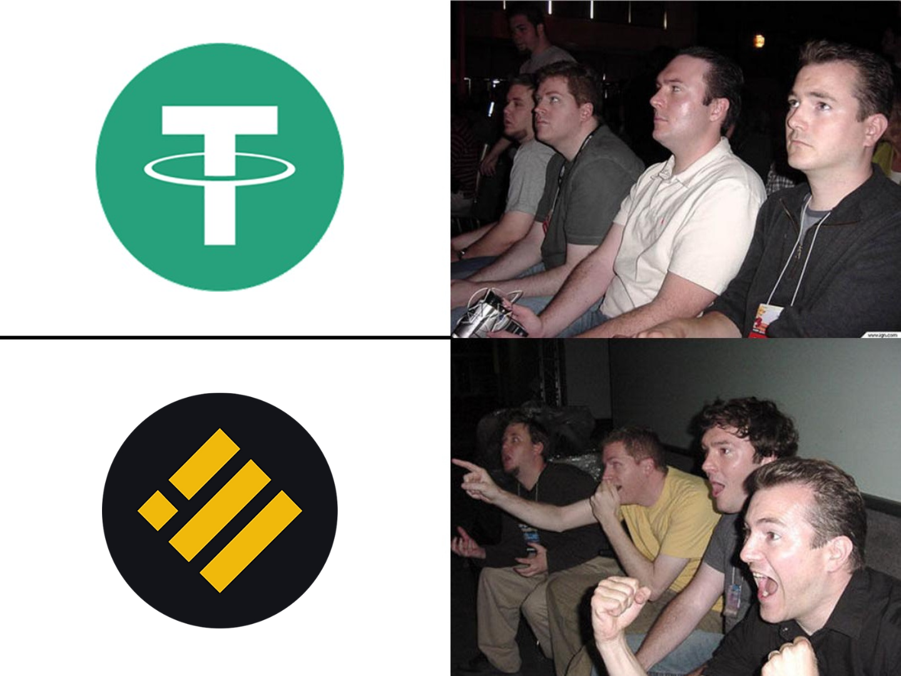

# Why Choosing BUSD?

Why do we choose BUSD instead of USDT and BNB to be the base of the liquidity pool and the vault.

## The Bear Market

The global economy is not going well these days, so we prefer choosing stable coin to be the base of the LP and the vault.

## Why BUSD instead of USDT?

According to the Reserves Breakdown that Tether and Binance provide.

BUSD is having much powerful backup of the US Dollar.

